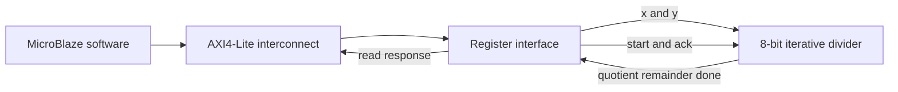

# AXI4-Lite Divider IP & MicroBlaze SoC

**8-bit unsigned divider · 32-bit AXI4-Lite · SystemVerilog · FPGA integration**

在课程 SoC 集成背景下实现除法数据通路和 AXI4-Lite 寄存器接口，完成 IP 封装与 MicroBlaze 集成。`rtl/` 为个人原始完成版，`tb/legacy_interface_sva_tb.sv` 为原接口 TB；新增测试和 `follow-up/` 内的修复属于之后的作品集整理工作。MicroBlaze、互联、时钟和厂商 IP 不包含在本目录中。

## 数据与控制路径



| 偏移 | 写入 | 读取 |
| --- | --- | --- |
| `0x0` | 被除数 `X[7:0]` | 商，零扩展至 32 bit |
| `0x4` | 除数 `Y[7:0]` | 余数，零扩展至 32 bit |
| `0x8` | bit 0 触发 `start` | bit 0 为 `done` |
| `0xC` | bit 0 触发 `ack` | 0 |

地址为 IP 内偏移，不在公共文档中假定系统绝对基址。仅低字节 `WSTRB[0]` 影响当前寄存器；高字节写使能不会更新 8-bit 操作数。接口返回 OKAY，无错误响应扩展。

## 关键实现

1. **写通道解耦。** AW 和 W 分别握手、锁存，用两个待处理标志记录完整事务；两者齐备后只提交一次。存在未消费的 B 响应时停止接收下一次写事务。
2. **控制脉冲。** `start` / `ack` 每拍默认清零，仅在控制寄存器写事务提交时产生脉冲。
3. **除法状态机。** IDLE 接收操作数；COMP 反复减去除数并累加商；余数小于除数后进入 DONE，等待 ack 返回 IDLE。执行时间与输入有关。
4. **读响应。** 原版组合选择返回值，在反压下有数据保持缺陷。之后独立整理的修复版在 AR 握手时锁存返回值，直至 R 握手完成；该修复不属于原始完成版。

## 代码入口

- [原始接口 RTL](rtl/div_axi_if.sv)
- [后续读响应修复版](follow-up/read-response-fix/div_axi_if.sv)
- [真实除法器 RTL](rtl/divider.sv)
- [公开接口回归](tb/tb_axi_public.sv)
- [非零除数全输入组合测试](tb/tb_divider_exhaustive.sv)
- [历史接口 SVA TB](tb/legacy_interface_sva_tb.sv)：内含简化 divider stub，不能与真实 `divider.sv` 同时编译。

从仓库根目录运行 `python scripts/run_axi_tests.py` 会验证原始项目：算术测试通过，接口测试复现已知缺陷并返回非零。修复版通过当前测试，可这样保留日志和波形：

```sh
python scripts/run_axi_tests.py --variant read-response-fix --output-dir build/axi
```

## 实现报告与版本边界

| 历史报告对象 | 结果 |
| --- | --- |
| 修改前的独立 IP 综合 | 50 LUT / 62 FF / 0 BRAM / 0 DSP |
| 修改前完整 MicroBlaze SoC 的布局布线 | 现有 100 MHz 约束下 WNS = 1.186 ns |

这些数字于作品集整理时重新读取原报告确认，**后续读数据锁存修复版没有重新综合或实现**。WNS 为特定约束下的余量，不等于芯片 Fmax 或 ASIC 签核结果。

除数为 0 尚无异常处理，会停留在 COMP；公开算术支持域为 `X=0..255, Y=1..255`。软件应先检查除数，并按 start → poll done → read result → ack 的顺序使用模块。当前接口不承诺在 busy 状态接收新运算。

详细测试、修复对照和证据见 [VERIFICATION.md](VERIFICATION.md)。
