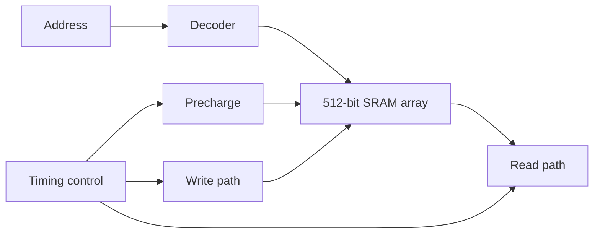

# 45 nm digital circuits & SRAM

**Cadence Virtuoso · RCA · comparator · DFF / scan DFF · 512-bit SRAM**

课程背景下的晶体管级数字电路设计、仿真与版图实践。项目包括加法器、8-bit 比较器、触发器以及 SRAM 阵列和外围电路的分层集成。

## 设计内容

- 比较标准单元与晶体管级 4-bit ripple-carry adder，在相同负载下分析进位路径。
- 比较两种级联比较器结构，评估结构选择对版图面积的影响。
- 完成 DFF / scan DFF 电路与时序分析，在比较器和触发器项目中执行版图、DRC/LVS 及后仿检查。
- 集成 512-bit SRAM 阵列、译码、预充电及读写外围，验证读写时序。

## 报告指标

| 项目 | 条件与基线 | 对比结果 |
| --- | --- | --- |
| 4-bit RCA | 同一 100 fF 负载，标准单元 vs 晶体管级方案 | 最坏进位延迟 311.0 ps → 236.1 ps，减少约 24.1% |
| 比较器 | 两种实现的版图尺寸 1.89×97.14 与 1.89×65.10 | 面积减少约 33.0% |
| SRAM | 512-bit 阵列及外围电路 | 读写功能与时序分析 |

数字来源于个人课程报告的既有核对记录，本次重新核算比例，未重新运行电路仿真或版图检查。RCA 对应报告第 18 页；比较器尺寸对应报告第 30、35 页。未将各级延迟相加的估算包装为完整电路后仿测量。

可以从仓库根目录执行 `python scripts/recompute_metrics.py` 重算两项百分比。

## 流程边界

DRC/LVS 与后仿范围明确限定在比较器和触发器项目。SRAM 读写仿真不代表完整 SRAM 版图签核、PVT 全覆盖或可制造性结论。比较器面积与 RCA 延迟属于不同电路，不能合并为同一设计的 PPA 改善。

PDK、厂商模型、课程手册与完整原报告不在公开仓库中；本页以重写的技术摘要展示设计思路和测量条件。
