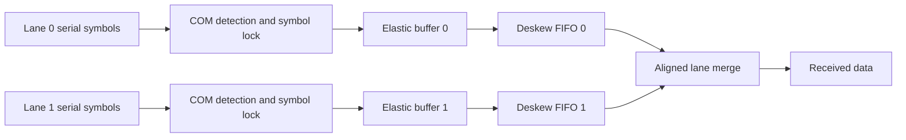

# PCIe PHY receive-path modules

**Dual-lane educational model · Verilog · 8b/10b · CDC · elastic buffer · deskew**

基于课程双 lane 简化平台完成六个编解码和接收链路模块的关键 RTL，实现符号锁定、频差补偿和 lane 对齐。这里展示个人实现思路与结果摘要；课程框架、golden 实现、厂商 IP 和原测试平台没有公开。

## 接收路径

此图表达职责与数据流，不代表完整 PCIe PHY 或商用 IP 的全部模块层次。

## 实现与取舍

- 通过 COM 检测建立符号边界，处理 8b/10b 编解码相关控制。
- elastic buffer 处理收发时钟差异。读指针经 Gray 编码和同步送入另一时钟域，根据缓冲水位在 SKP 有序集中增删 SKP。
- deskew FIFO 处理各 lane 的到达偏移，使合并时对应的数据符号属于同一组。
- 两类缓冲职责不同：频差会持续累积，lane 偏移影响跨 lane 同组关系；不能只用一个“FIFO”概念代替两种控制。
- 集成接收对齐、deskew、elastic buffer 三类 ILA 观测点。

## 验证证据

原工程的两组结果文件 `result_2.txt`、`result_3.txt` 各包含 72 个数据 token。本次重新比较它们与各自 golden 输出：**两组均在忽略空白后完全一致**。文件哈希和比较结果在 [output_comparison.json](evidence/output_comparison.json)。

历史验证涉及收发频差、lane 到达偏移与 SKP 补偿；本次只重新比较已有输出，没有重新运行 Vivado，也没有新增上板测试。ILA 集成不等于已经证明板级链路稳定。

## 范围

本项目不能据此宣称完整 PCIe 协议栈、LTSSM 全覆盖、所有速率代际或协议一致性认证。Gray 指针同步实践也不等于完成 CDC 工具签核。可讨论的核心是：水位计算的延迟、SKP 修改条件、锁定与对齐的启动时序，以及错误如何传播到输出比较。
