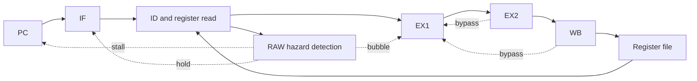

# Five-stage pipeline CPU

**Verilog · 16-bit datapath · 32-bit custom instruction · RAW hazard control**

课程背景下的五级流水线数据通路与控制实现，包含 IF、ID、EX1、EX2、WB，16 × 16-bit 寄存器堆和 MOV、SUB3、ADD4、ADD1、NOP 自定义指令。这不是 RISC-V ISA 实现，也不是 Tomasulo 项目的流水线前端。



## 关键机制

- 检测源寄存器对在途目的寄存器的依赖，并结合结果可用阶段选择旁路或停顿。
- 停顿时保持 PC/IF-ID，向后续阶段插入气泡，避免同一指令被重复执行。
- 多个阶段同时匹配同一目的寄存器时，旁路选择必须取得程序顺序中较新的结果。
- 寄存器写回地址、数据和写使能需要在同一流水级对齐。

## 验证方法与现有结果

通过定向指令序列和寄存器终值检查停顿、旁路及写回。简历记录包含 37 条指令和 61 周期执行轨迹；本次未重新运行该流程，因此不将该周期数字作为新回归结果。

本次读取现有寄存器输出文件，得到以下 16 个寄存器的最终值（按输出顺序，十六进制）：

```text
0008 0009 000c 0025 000a 000d 0043 0080
0102 0043 0043 0044 0044 0041 fff8 ffff
```

该记录是历史输出摘要；单独一组终值不足以证明所有冒险组合正确，周期级停顿与旁路仍需结合波形检查。

## 展示范围

原文件包含明确的课程保密及禁止公开声明，因此这里公开个人重写的架构说明与结果摘要，不上传课程 exercise、完成版源码或教学 testbench。寄存器输出记录的来源信息见 [证据索引](../../docs/PROVENANCE.md)。

可继续扩展的验证点包括连续同目标写入、EX2/WB 同时命中、不同类型指令依赖链和复位边界。
