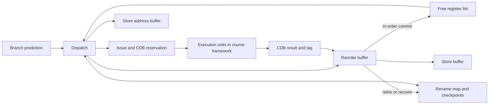

# Tomasulo dynamic scheduling

**VHDL · register renaming · checkpoint recovery · ROB · scheduled CDB writeback**

在课程提供的乱序处理器框架内完成八个关键模块的实现与集成验证。本项目与 Verilog 五级流水线是两个独立项目；展示范围为关键模块，不声称从零实现整颗乱序处理器及全部基础设施。

## 模块与职责

| 模块 | 实现重点 |
| --- | --- |
| BPB | 分支预测相关状态 |
| CFC | 寄存器映射、检查点与恢复 |
| FRL | 空闲物理寄存器分配和回收 |
| Dispatch | 检查资源与建立分派信息 |
| Issue | 发射控制，按执行单元延迟预约 CDB 写回时隙 |
| ROB | 完成状态、按序提交和错误路径处理 |
| SAB / SB | 访存缓冲及与提交控制的配合 |

设计重点是维持逻辑顺序与资源生命周期：年轻指令可以先完成，但提交必须按序；误预测后应恢复映射和可用资源，错误路径结果不能继续影响架构状态。

## 回归证据

重新读取 `bpb/cfc/dispatch/frl/issue/rob/sab/sb` 各目录的 **Tomasulo_do_file_log.txt**：每份包含 20 次 `Comparison Passed`，并有全部仿真通过的总结。详见 [regression_summary.json](evidence/regression_summary.json)。

这代表八个模块测试目录各有 20 次历史指令流比较记录，**不是 160 种不同指令流**；相同测试流会在不同模块目录重复。多份摘要文件内容相同，因此其哈希相同，也不构成独立签名或外部认证。

`TomasuloCompareTestLog.log` 在当前材料中为空，未用作通过依据。本次没有重新运行这些课程仿真。框架比较对象和测试充分性还需原始测试平台才能完整复现；此仓库不发布该平台或 golden 实现。

## 讨论重点

- 物理寄存器何时分配、何时安全回收。
- 分支误预测时检查点与 ROB 清理如何配合。
- 预约 CDB 时隙与动态竞争仲裁的差别，以及对执行延迟的假设。
- store 地址准备好与允许对架构可见的写入之间的区别。
